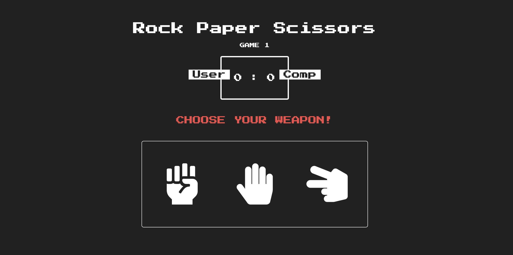

# Rock-Paper-Scissor

A simple game of rock paper scissors.

### Screenshot

- Live Site URL: [Netlify lik](https://competent-beaver-a44bcf.netlify.app)
### Built with

- Semantic HTML5 markup
- CSS 
- Flexbox

### What I learned

I learnt DOM manipulation and how to use switch statement through this project.  I've added improvement to this project by adding CSS animation and transitions.

### Continued development

The things I need to do after this is improve my code using ES6+ to shorten the file
length, and fix the lag.

